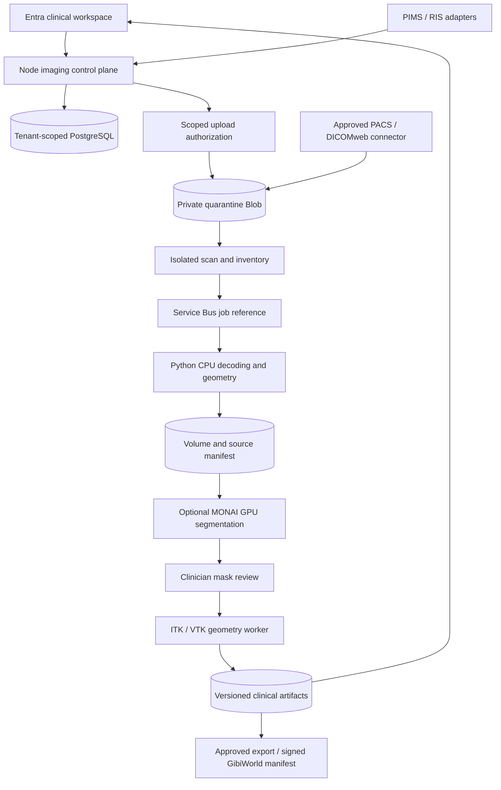

# DICOM imaging service: implementation architecture

Status: proposed system architecture with the D1 offline CT decoding foundation implemented.
Baseline: September 17, 2026. Owner assignments and clinical intended use remain open.

## 1. Outcome and scope

A veterinarian imports an authorized study, confirms the patient and series, reviews source slices alongside derived anatomy, corrects segmentation, and approves a versioned model for a specified planning or rehearsal use. Every measurement and export remains traceable to source pixels and a reviewed transform.

This specification extends [clinical twin architecture v2](VIRTUAPET_CLINICAL_DIGITAL_TWIN_ARCHITECTURE_v2.md) with service boundaries, contracts, processing decisions, and implementation milestones. It does not authorize robotic control or declare clinical effectiveness. No patient datasets or trained model weights were supplied in this task; the initial tests generate synthetic DICOM files.

## 2. Current code versus delivery target

| Component | Current evidence | Target |
|---|---|---|
| Node imaging module | Metadata validation, workflow contracts, prototype reconstruction/segmentation | Authenticated control plane backed by worker results |
| Python worker | Actual native classic CT pixel decoding and geometry validation; offline only | Isolated jobs with approved transfer syntaxes and provenance |
| Segmentation | Existing Node labels and uncertainty are fixture outputs | Measured masks and uncertainty from versioned algorithms |
| Mesh pipeline | Prototype interfaces | Geometry derived from approved masks, with measured errors |
| Clinical viewer | Not implemented by this slice | Source-linked MPR, editing, comparison and approval |
| Clinical validation | Synthetic engineering tests only | Governed representative data and independent clinical review |

The old Node functions must not be wired as fallback processing. Their synthetic origins, nominal-thickness spacing and fixed uncertainty are not acceptable inputs to clinical decisions. Replacement requires a contract migration; this slice adds no production endpoint and changes no deployment flags.

## 3. Architecture and trust boundaries

Entra owns VirtuaPet users and server-verified memberships. Clerk remains confined to Layer8. Layer8 supplies entitlement decisions; an entitlement does not grant access to a clinical case. Case access additionally requires clinic role, patient association, consent/legal purpose, and current artifact approval. No browser token is forwarded to processing workers.

Workers receive internal job IDs, tenant IDs, immutable input object references, expected hashes, algorithm/configuration versions and correlation IDs. The API derives this context; clients cannot choose storage prefixes or effective tenants. Managed identities use separate quarantine, source, derived, and export permissions. Object names contain opaque IDs, not patient names. Queue messages and logs contain no raw DICOM, access tokens, or patient demographics.

## 4. Technology decisions

| Layer | Decision and rationale |
|---|---|
| Control plane | Existing TypeScript/Fastify API and PostgreSQL; retain current identity and transaction isolation |
| Initial processing | Python 3.11–3.13, pydicom and NumPy, with a committed uv lockfile |
| Advanced processing | Evaluate SimpleITK/ITK for registration, resampling, region growing and level sets; validate each operation before adding it |
| Geometry | VTK or an equivalently validated isosurface implementation; preserve a full-resolution analysis mesh separately from display derivatives |
| AI | MONAI on PyTorch for a procedure-specific 3D U-Net baseline; no human pretrained model assumed valid for veterinary anatomy |
| Acceleration | CPU baseline first; CUDA workers after profiling and CPU/GPU equivalence tests; OpenCL and custom C++ only where justified by measured bottlenecks |
| Web | Cornerstone3D for DICOM/MPR and segmentation tools, Three.js for derived surfaces; server remains approval authority |
| Desktop | Qt/PyQt deferred unless offline deployment or device requirements demand it |
| PACS transport | DICOMweb first; DCMTK gateway for separately approved DIMSE sites with TLS/network controls |

These are architectural selections, not claims that every dependency is installed or validated. Record licenses, SBOMs, decoder versions and native dependencies before a release.

## 5. Data model and API contracts

Every persisted record carries tenantId, caseId, createdBy, timestamps, schemaVersion and correlationId. Composite tenant foreign keys and forced RLS must enforce ownership across joins.

| Entity | Additional required fields |
|---|---|
| ImagingCase | Internal pet/encounter references, source patient mapping, intended use, consent version |
| UploadSession | Server-owned object prefix, count/byte quotas, expiry, completion checksum inventory |
| SourceInstance | Study/Series/SOP/FrameOfReference UIDs, content hash, transfer syntax, object version; identifiers remain restricted |
| SeriesInventory | Patient/issuer consistency, modality, geometry, completeness decision, warnings and source list |
| ProcessingJob | Idempotency key, input hashes, versioned parameters, state, attempt/lease, cancellation, safe failure code |
| VolumeArtifact | Shape/order/dtype, voxel units, affine, orientation semantics, input hashes, software versions, content hash |
| SegmentationVersion | Source volume, label dictionary, model/config hash, correction lineage, reviewer and quality report |
| MeshVersion | Mask version, coordinate frame, units, topology, extraction/optimization settings, error measurements |
| Approval | Exact artifact hash, intended use, approver role, decision and reason; immutable and revocable |
| Export | Format, coordinate transform, source approval, expiry, recipient, purpose, checksum and audit reference |

Proposed routes use a new `/v1/clinical-imaging` namespace to avoid silently changing prototype routes:

- `POST /cases` and `POST /cases/:id/uploads`: authorize case creation and bounded upload sessions.
- `POST /uploads/:id/complete`: verify actual object inventory and hashes, then enqueue; return 202.
- `GET /cases/:id/series`: return authorized metadata and review warnings.
- `POST /cases/:id/jobs`: accept an allowlisted operation and existing source version, never executable code or arbitrary URLs.
- `GET /jobs/:id` and `POST /jobs/:id/cancel`: return state/safe errors and request cancellation.
- `GET /cases/:id/artifacts/:version`: issue short-lived authorized reads with no-store metadata.
- `POST /segmentations/:id/corrections`, `POST /artifacts/:id/approvals`, `POST /artifacts/:id/revocations`.
- `POST /cases/:id/exports`: require fresh authorization and an exact approved version; queue export generation.

Mutating requests require idempotency keys scoped to tenant and operation. Conflicting reuse returns 409. Jobs use compare-and-swap state transitions and immutable outputs, so at-least-once queue delivery cannot create competing approved versions.

## 6. DICOM ingestion and geometry

Source bytes remain immutable. Quarantine must include malware scanning, parser isolation, byte/count/pixel limits, archive traversal and expansion limits, and approved transfer syntax handling. A DICM marker alone is not malware clearance. Initial offline support accepts only native explicit/implicit little-endian, single-frame classic CT, 16-bit monochrome pixels with explicit HU rescale metadata. Enhanced CT, MR, compression, padding, modality LUTs and quadruped orientation reject with safe codes until separate implementations and tests exist.

Geometry convention: arrays are `[slice,row,column]`; the 4x4 affine maps `[column,row,slice,1]` to patient coordinates in millimeters. Use ImagePositionPatient and ImageOrientationPatient to sort slice planes and derive center spacing. SliceThickness is nominal and must not substitute for measured center spacing. Reject duplicate planes, inconsistent orientation/spacing and unsupported shear; preserve source origin. [DICOM Image Plane Module](https://dicom.nema.org/medical/dicom/current/output/chtml/part03/sect_C.7.6.2.html).

For BIPED coordinates, LPS-to-RAS uses a left multiplication by diag(-1,-1,1,1). QUADRUPED requires body-region-aware axis semantics and reviewer confirmation; the scaffold rejects it rather than relabeling it. A scanner's absent/BIPED declaration is not proof that veterinary anatomical labels are correct.

Future conformance expansion must group MR by acquisition/echo/time/diffusion dimensions, handle enhanced multiframe functional groups, validate compressed decoder dependencies, and preserve intensity units. Do not label arbitrary MR values as HU. Uniform slice spacing cannot prove full study completeness: acquisition inventory or operator confirmation is required before processing release.

## 7. Interoperability and identity reconciliation

PIMS/RIS adapters map `(source system, patient identifier, issuer)` to the internal pet and encounter through an explicit reconciliation workflow. Owner name or matching display names never suffice. Preserve species, breed, source timestamps, corrections, accession number and provenance. Ambiguous mappings block ingestion approval.

DICOMweb connectors implement scoped QIDO-RS query, WADO-RS retrieval and, where approved, STOW-RS storage. Connector hosts are administrator-allowlisted; validate redirects, address resolution, payload limits and tenant credential ownership to prevent SSRF. Vendor credentials remain in Key Vault. Optional HL7 v2 feeds use negotiated message profiles and acknowledgements; FHIR resources such as ImagingStudy, DiagnosticReport and Observation use a pinned partner version/profile with veterinary extensions negotiated explicitly. The source system remains the authority for its records.

## 8. Segmentation and validation

Begin with transparent threshold/connected-region tools and clinician correction. Save actual voxel masks and operations, not just anatomy labels. Threshold masks do not establish the identity of a structure. Track crop, resampling, interpolation and inverse transforms so results return to source space.

Train/evaluate a 3D U-Net only on governed data. Split by animal and site to avoid leakage; record scanner/protocol/species/breed distributions, preprocessing, seed, weights hash and hardware. Require independent labels and held-out validation. Report per-structure surface distance, overlap, measurement error, failure rate and subgroup results. Model confidence needs calibration; no fixed uncertainty score may imply measured confidence. [MONAI project](https://arxiv.org/abs/2211.02701).

Exact clinical thresholds and dataset size come from the approved intended use and statistical protocol. Existing roadmap example tolerances are planning targets, not validated surgical tolerances. Out-of-distribution inputs, missing anatomy and unresolved corrections block approval. GPU acceleration must be benchmarked for both numerical agreement and reproducibility.

## 9. Meshes and exports

Extract surfaces from approved masks using marching cubes with tested voxel-center conventions and affine application. Preserve full-resolution clinical meshes. Smoothing, decimation and hole closure each create a derivative with before/after surface and volume deviation measurements; never repair away uncertainty without review.

Check finite coordinates, degenerate faces, disconnected components, normals, winding, self-intersections, non-manifold edges and topology. Watertightness alone does not prove anatomical accuracy or manufacturability.

Support staged exporters for STL, OBJ, PLY and 3MF. STL has no reliable embedded units; require a signed sidecar declaring mm, frame, transform, source hash and approval. Preserve equivalent provenance for every format and validate round trips. Clinical interchange should prefer DICOM SEG/surface/registration/SR where compatible. Display GLB exports use explicit transforms and are ineligible for manufacturing. PSI and robotic uses require their separate milestone evidence.

## 10. Viewer workflow

Show source slices, MPR and the linked surface with patient/case confirmation, orientation labels, scale, source version, uncertainty and quality findings. Support mask edits, undo/version comparison, measurements, draft saving and explicit approval. Approval is invalidated by any source or derived change. [Cornerstone3D overview](https://www.cornerstonejs.org/docs/getting-started/overview/).

Load only case-authorized objects; suppress persistent browser caching of clinical content. Test keyboard use, color/contrast, large-volume limits, cross-case state clearing and stale-version warnings. Every supported headset needs physical scale, orientation, interaction and performance evidence.

## 11. Privacy, quality and regulatory design

Clinical care and research have distinct access paths. Keep identifiable source data restricted; research/export copies require an approved de-identification policy covering nested sequences, private tags, UID remapping, dates, overlays, burned-in text and potentially identifying anatomy. Store re-identification maps separately. Hashing PatientID alone is pseudonymization, not complete de-identification. The new worker makes no de-identification claim.

Where HIPAA applies, select and document Safe Harbor or Expert Determination rather than assuming tag removal suffices. Veterinary records require a separate applicability assessment; human owner/staff data still needs protection. [HHS de-identification guidance](https://www.hhs.gov/hipaa/for-professionals/special-topics/de-identification/index.html). For GDPR-relevant personal data, document controller/processor roles, legal basis, minimization, retention, deletion, international transfers and whether outputs remain identifiable; obtain a jurisdiction-specific review before deployment.

Use an IEC 62304-aligned lifecycle plan with requirements-to-hazards-to-tests traceability, dependency controls, change review, problem resolution and release evidence. This is a process target, not a certification claim. [IEC 62304 overview](https://www.iso.org/standard/38421.html).

Do not assume a human-device clearance pathway applies to veterinary software. FDA states that animal devices do not require 510(k), PMA or other premarket approval, while retaining oversight. [FDA animal-device guidance](https://www.fda.gov/animal-veterinary/animal-health-literacy/how-fda-regulates-animal-devices). EU MDR addresses human-use devices; determine applicable veterinary, software, hardware and national obligations before claiming CE conformity. [EU MDR](https://eur-lex.europa.eu/eli/reg/2017/745/oj/eng/pdf). Human-use expansion requires a separate intended-use and regulatory assessment.

## 12. Runtime, deployment and operations

Production workers run as non-root jobs with read-only images, isolated scratch disks, disabled general egress, explicit CPU/memory/time quotas and bounded parallelism. Parsing remains isolated from the API. Dedicated GPU pools are added only for approved inference jobs. Cancellation is checked between stages; expired leases and poison messages go to a dead-letter queue. Retry transient storage/queue failures, not deterministic invalid input.

Record stage duration, queue age, memory high-water mark, retry/rejection counts and approval latency without patient data. Alert on dead letters, hash mismatches and access violations. Use signed images, SBOMs, pinned environments and versioned parameter manifests. Backup and restore metadata, objects and encryption-key access together. Retention deletion covers derivatives and respects documented holds.

Deploy the control plane default-off, first to synthetic-data staging. Before cutover, prove tenant isolation through database and storage, worker containment, rollback to prior image/schema compatibility and restoration. No new Azure deployment is part of D1.

## 13. Milestones and acceptance

| Phase | Work | Gate / accountable role |
|---|---|---|
| D0 specification | This design, scope and risk register | Engineering/security/clinical owners review; assignments pending |
| D1 offline decode | Python package, native CT pixels, affine, rejection tests, lockfile, CI | Synthetic numerical and adversarial tests pass; implemented this slice |
| D2 secure ingestion | Authenticated API, schema migration, Blob quarantine, queue, sandbox, de-identification workflow | Actual storage/RLS isolation, malicious-input and recovery tests; platform/security |
| D3 modality expansion | MR, enhanced CT, compressed syntaxes, quadruped profiles and completeness reconciliation | Curated conformance matrix plus scanner/clinical review; imaging lead |
| D4 masks and surfaces | Classical segmentation, MONAI experiment pipeline, VTK meshes, format exports | Reference masks, transform and mesh-error tests; imaging/ML leads |
| D5 review experience | Cornerstone MPR, editing, approvals, GibiWorld delivery | Source-linked workflow and physical-device acceptance; clinical/UX leads |
| D6 planning release | Locked procedure, independent retrospective/prospective evidence and operations | Clinical, security, quality and jurisdiction review; named release board |
| D7 robotics program | Simulation, hardware interface, lab/phantom/cadaver and supervised studies | Separate robotic surgery roadmap; no direct command path from imaging |

D1 tests must prove non-square pixels, reversed slice input, oblique coordinates, signed stored values, per-instance rescale, mixed-patient/frame rejection, limits and malformed files. D2 adds no-network parser containment and PHI-log inspection. Later phases add SEG/export round trips, calibrated model evaluation and clinical study evidence. Passing synthetic tests closes only the engineering gate for their supported subset.

## 14. Initial risk register

| Hazard | Control and evidence |
|---|---|
| Wrong patient or tenant | Server-derived case context, issuer-aware matching, composite keys, cross-tenant live tests |
| Mirrored/scaled anatomy | Explicit affine/order contract, oblique phantom tests, laterality review |
| Incomplete or heterogeneous acquisition | Inventory reconciliation, partitioning, reject unsupported geometry |
| Misleading synthetic outputs | Prototype quarantine, worker provenance, no fixture fallback |
| Parser exploit/resource exhaustion | Isolated worker, size/dimension caps, process quotas, fuzzing |
| Incorrect segmentation/mesh | Independent reference studies, measured uncertainty, clinician approval |
| Privacy leakage | Restricted source storage, approved de-identification, no payload logs |
| Stale plan or export | Immutable hashes, revocation, fresh approval and entitlement checks |

## 15. Next implementation ticket

Implement D2 as an authenticated synthetic-data staging workflow: upload session -> private quarantine -> inventory verification -> job reference -> isolated D1 worker -> immutable volume manifest -> authorized status read. Add integration tests that prove another tenant cannot upload into, run, list or download that case. Do not expose the existing fixture reconstruction as a production processing path.
