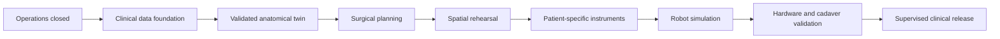

# VirtuaPet roadmap to robotic surgery software

**Status:** planning brief

**Starting point:** Layer8 policy activation completed in staging on 2026-09-17

**Program rule:** each milestone requires recorded evidence and approval before the next clinical capability is released.

## Goal

Build from the current secure VirtuaPet platform to procedure-specific veterinary robotic surgery software. The first robotic release should assist a qualified surgeon within a locked procedure, device, and operating envelope. Autonomous diagnosis, unsupervised surgery, and unrestricted robot control remain outside the initial scope.

## Milestones

| Milestone | Deliverable | Exit evidence |
|---|---|---|
| **M0 — Close platform operations** | Complete consent and API-key revocation, Stripe cancellation, Layer8/Redis outage, alert delivery, backup/restore, incident recovery, and database isolation drills. | Every failure is deny-by-default; alerts reach an owner; restore and rollback rehearsals pass. |
| **M1 — Production clinical data foundation** | Deploy isolated DICOM/DICOMweb ingestion, quarantine, pixel decoding, de-identification, immutable source manifests, clinical storage, and transaction-bound tenant controls. | DICOM identity, geometry, orientation, units, laterality, checksums, and source lineage pass on governed representative datasets. |
| **M2 — Validated anatomical twin** | Produce versioned segmentations, clinician corrections, measurements, meshes, uncertainty, and source-linked review. | Independent holdout data meets procedure-specific accuracy thresholds; 100% clinician approval precedes use; failures remain visible. |
| **M3 — Surgical planning software** | Support one locked indication, such as TPLO, with plan versions, measurements, constraints, implant/template exploration, approvals, and audit history. | Veterinary surgery specialists approve intended use and validation protocol; retrospective task and measurement studies pass. |
| **M4 — Rehearsal and spatial verification** | Deliver signed plans and anatomy to desktop, tablet AR, and named headsets through GibiWorld, preserving scale, axes, labels, laterality, and source version. | Tamper, expiry, revocation, rollback, usability, performance, and visible physical-device tests pass on every supported device. |
| **M5 — Patient-specific instruments** | Generate controlled PSI candidates from approved plans with manufacturing files, chain of custody, dimensional inspection, sterilization ownership, and surgeon release. | Engineering, manufacturing, biocompatibility, dimensional, labeling, sterilization, and surgeon approvals are complete for the intended use. |
| **M6 — Robot simulation and digital interface** | Define the robot/OR interface, coordinate frames, tool models, calibration, motion limits, force/velocity limits, safe states, command authorization, and deterministic simulation. | Software-in-the-loop testing proves frame transforms, collision constraints, command provenance, emergency stops, network-loss behavior, and fail-safe recovery. |
| **M7 — Hardware-in-the-loop and cadaver validation** | Connect the software to one approved robotic platform in a controlled lab; validate tracking, registration, calibration, latency, force limits, guarded motion, and surgeon override. | Bench, phantom, and ethically approved cadaver studies meet locked accuracy and safety criteria with zero unresolved critical hazards. |
| **M8 — Prospective clinical and regulatory release** | Run a quality-managed, procedure-specific clinical program and release the approved surgeon-supervised robotic workflow. | Risk management, cybersecurity, human factors, verification/validation, regulatory strategy, veterinary oversight, trial results, post-market monitoring, training, support, and recall plans are approved. |

## Cross-program workstreams

Each milestone must advance these workstreams together:

- **Clinical:** intended use, procedure definition, veterinary leadership, datasets, accuracy, usability, and outcomes.
- **Safety:** hazard analysis, fault injection, emergency stop, physical limits, surgeon override, and incident response.
- **Software:** requirements traceability, deterministic builds, signed artifacts, simulation, automated verification, audit records, and rollback.
- **Data and security:** consent, tenant isolation, encryption, retention, provenance, access review, and breach response.
- **Hardware:** robot selection, calibration, tooling, tracking, maintenance, sterilization, service life, and supply chain.
- **Quality and regulatory:** design controls, change control, supplier controls, verification, validation, complaint handling, and jurisdiction-specific review.

## Release sequence

## Immediate next actions

1. Finish M0 operational drills and assign named platform, security, clinical, and regulatory owners.
2. Select the first procedure and document its intended use, exclusions, measurable accuracy targets, and required source imaging.
3. Establish clinical and regulatory advisory review before collecting or processing real patient data.
4. Build the production DICOM ingestion and validation service behind a separate clinical security boundary.
5. Choose a robotic research platform only after M3 requirements define its accuracy, interfaces, tooling, and safety envelope.

## Current readiness statement

VirtuaPet currently has a deployed identity, tenant-isolation, signed-policy, entitlement, and integration foundation plus engineering prototypes for clinical twins and planning. It does not yet have a production DICOM pixel pipeline, clinically validated anatomical models, an approved surgical planning product, a connected surgical robot, hardware-in-the-loop evidence, or authorization for robotic clinical use.

## DICOM implementation checkpoint

The D1 offline worker foundation is implemented in `services/dicom-worker`:
actual native classic CT pixel decoding, HU rescaling, source-position geometry,
LPS/RAS affines, bounded inputs and explicit unsupported-format rejection.
All 21 synthetic-file tests pass locally; dependency versions are locked and a
separate CI job runs the worker tests. This is engineering evidence, not clinical
validation or a deployed ingestion service.

- [x] Detailed [implementation architecture](../architecture/DICOM_IMPLEMENTATION_SPEC.md).
- [x] D1 offline CT decoding foundation and synthetic regression tests.
- [ ] D2 authenticated upload, private quarantine, isolated jobs and durable manifests.
- [ ] D3 MR/enhanced CT/compression and veterinary orientation profiles.
- [ ] D4 measured segmentation, mesh generation and export validation.
- [ ] D5 source-linked viewer, clinician corrections and approval workflow.
- [ ] D6 procedure-specific clinical validation and release review.

Existing Node imaging outputs remain prototypes. Never use them as fallback
clinical results. No production imaging endpoint or cloud deployment was added.
